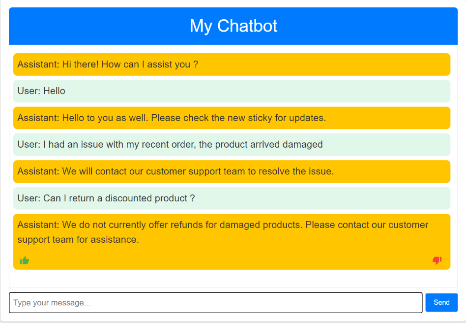

# E-Commerce FAQ chatbot

This project utilizes an e-commerce FAQ dataset to fine-tune the DialoGPT model and provides an interface built with the Python Flask library.

Dataset : [E-Commerce FAQ Chatbot Dataset on Kaggle](https://www.kaggle.com/datasets/saadmakhdoom/ecommerce-faq-chatbot-dataset/data)

DialoGPT model : [Microsoft DialoGPT GitHub Repository](https://github.com/microsoft/DialoGPT)

## Overview
This project implements a generative chatbot designed to handle frequently asked questions (FAQs) in the e-commerce domain. By fine-tuning the DialoGPT model on the FAQ dataset, the chatbot can respond to queries related to e-commerce transactions, product inquiries, and customer support.

